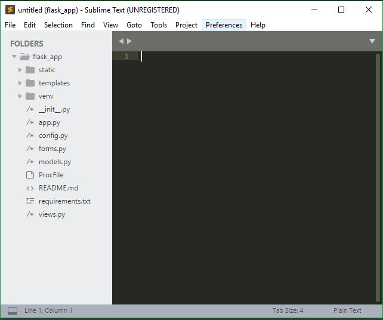
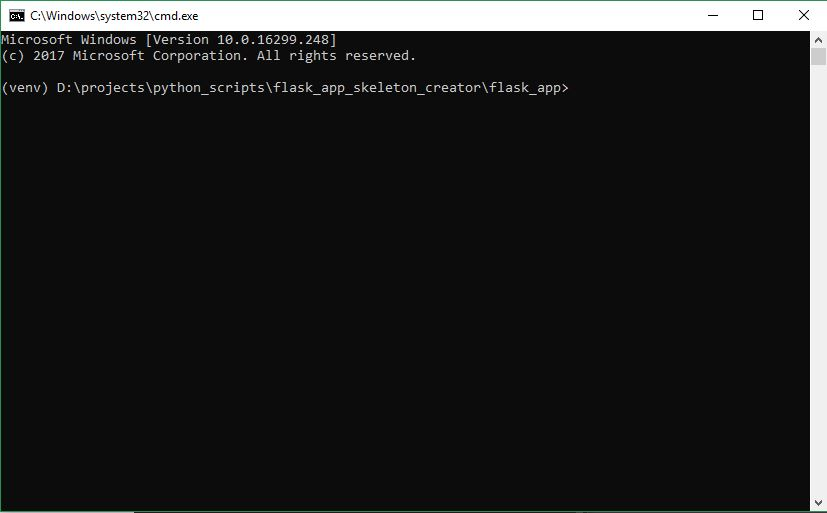

# Flask App Skeleton Creator
This script creates the basic structure of a flask application with virtually activated command prompt, sublime text editor and pre installs few modules.

## This script executes in four steps:
### 1. Creates a Flask Web App File Structure
```
your_app/
    config.py
    PorcFile
    requirements.txt
    README.md
    run.py
    instance/
        config.py
    venv/
    yourapp/
        __init__.py
        views.py
        models.py
        forms.py
        static/
            css/
            js/
            img/
        templates/
            layout.html
            index.html
```
### 2. Creates a activated virtual Environment and installs Flask module as well

### 3. Opens the Sublime text editior with the newly created flask app.


### 4. Opens the activated windows command promt


## NOTE:
This script is wirtten in context of Windows OS and there is need to set sublime text editor as a default text editor with alias name 'subl'.

## Best possible ways to use this script:
### 1. From project directory
Transfer this script file into your projects directory and execute it from the command prompt.
### 2. Using .exe application
Convert the python script file into .exe file and place this .exe file in the projects directory and pin a shortcut to your windows taskbar.
To convert .py to .exe: [http://py2exe.net](http://py2exe.net)
This is the best and convenient option to use this script.
