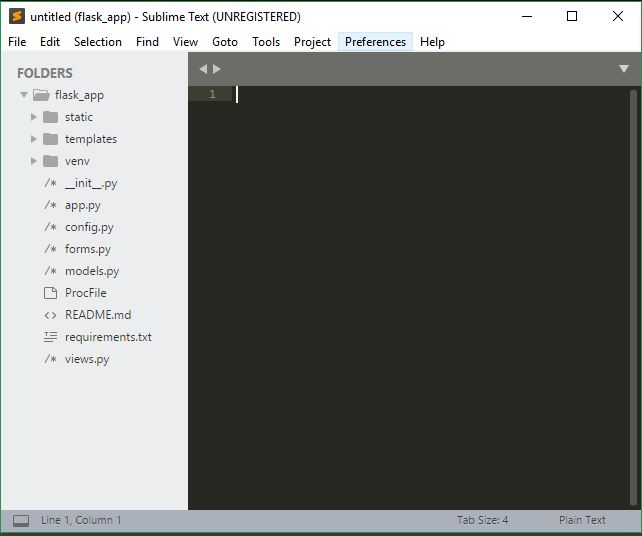
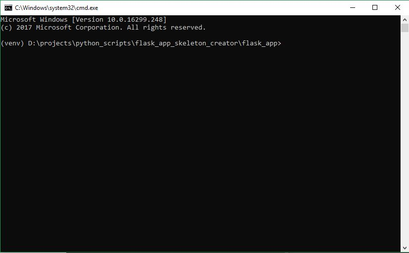

# Flask Application Skeleton Creator
This python script creates the basic structure of a flask web application with activated virtual environment and pre-installed flask module.

## This script executes four main steps:
### 1. Creates a Flask Web App File Structure
```
flask_app/
        - static/
              - css/
              - js/
              - img/
        - templates/
              - layout.html
              - index.html
        - venv/
        - __init__.py
        - app.py
        - config.py
        - forms.py
        - models.py
        - views.py
        - ProcFile
        - requirements.py
        - README.md
```
### 2. Creates a activated virtual Environment and installs Flask module as well

### 3. Opens the Sublime text editior with the newly created flask app.


### 4. Opens the activated windows command promt


## Best possible ways to use this script:
### 1. From project directory
Transfer this script file into your projects directory and execute it from the command prompt.
### 2. Using .exe application
Convert the python script file into .exe file and place this .exe file in the projects directory and pin a shortcut to your windows taskbar.
To convert .py to .exe: [http://py2exe.net](http://py2exe.net)
This is the best and convenient option to use this script.
